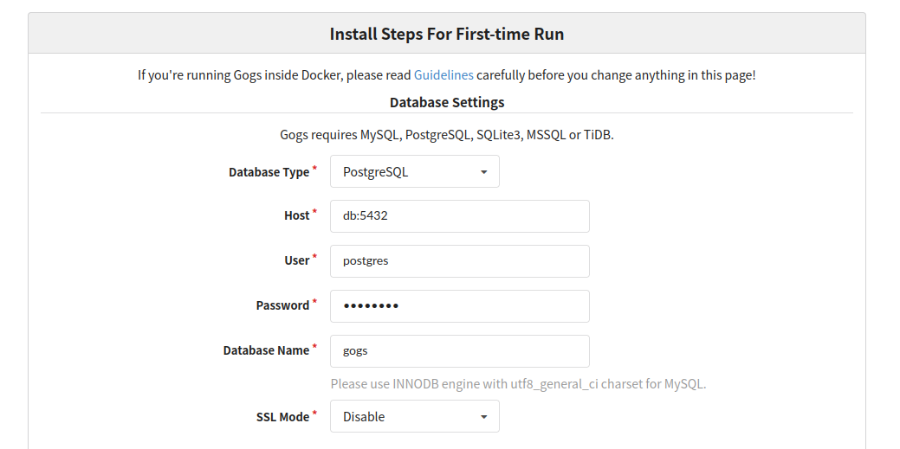

# Gogs with Traefik and Docker Compose

## Description
This is an out-of-the-box working setup to run Gogs configured with Traefik.

## Getting Started

### Set up Docker

1. Adjust the .env file fitting to your needs
2. Execute the bash script: ```bash setup.sh```
3. Start docker: ```docker compose up``` 

### Configure Web UI
* Your settings should look just like in the screenshot (the password can be found in the .env file)

<br/><br/>

* Set the proper URL


* The remaining settings don't need any change or can be adjusted to the personal preferences

